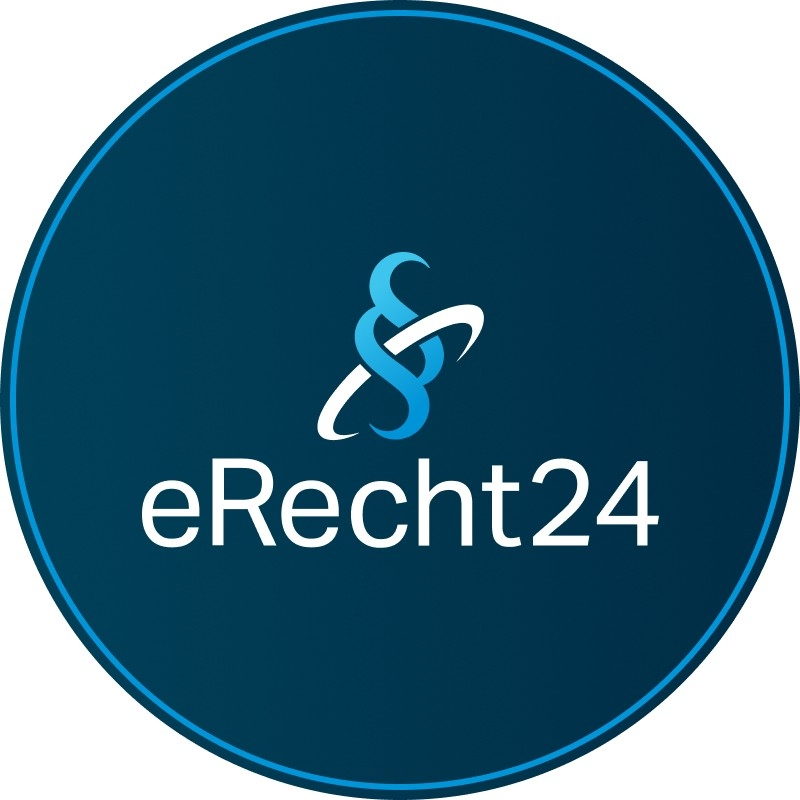

# eRecht24 Certified External Integrators

Welcome to the official eRecht24 directory of certified external developers.  
These developers are not employed by eRecht24 but have been approved to work with the eRecht24 API and may assist others
with integrations.

This repository is maintained by eRecht24 and also includes a collection of recommended SDKs, starter kits, and
boilerplate's in various programming languages and frameworks to simplify the integration process.

> ⚠️ **Important Notice:**  
> To use the eRecht24 API with your own developer key — e.g., when building custom plugins, SDKs, or direct integrations
> without using the official packages —  
> you **must have signed a usage agreement with eRecht24** beforehand.
>
> More information: [eRecht24 API usage requirements](https://www.e-recht24.de/mitglieder/benutzerkonto/erecht24-api-schnittstelle-optimal-nutzen/) (Premium Account needed)

---

## JavaScript / TypeScript

JavaScript and TypeScript are widely used for frontend and backend development in web applications.

### Frameworks

- **SvelteKit example by @robinrm** – [robinrm/sveltekit-and-erecht24-API-v2](https://github.com/robinrm/sveltekit-and-erecht24-API-v2)
- **TypeScript SDK by @LILA-IT** - [LILA-IT/eRecht24](https://github.com/LILA-IT/eRecht24)

---

## PHP

PHP is a server-side scripting language used to build dynamic websites and web apps.

### Frameworks

- **REDAXO CMS addon by @FriendsOfREDAXO** – [FriendsOfREDAXO/erecht24](https://github.com/FriendsOfREDAXO/erecht24)
- **Winter CMS plugin by @xitara** – [xitara/wn-erecht24-plugin](https://github.com/xitara/wn-erecht24-plugin)

---

## Go

Go (Golang) is known for its performance and is used in backend services and APIs.

- **Go SDK by @jjideenschmiede** – [jjideenschmiede/goerecht24](https://github.com/jjideenschmiede/goerecht24)

---
